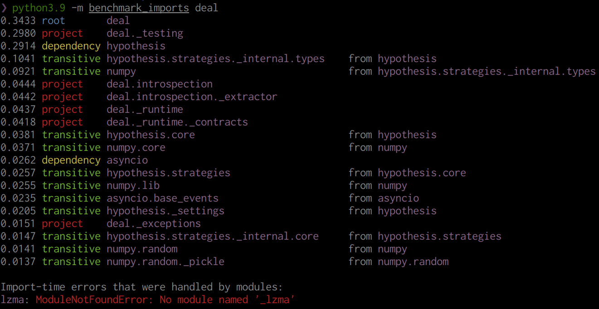

# benchmark-imports

A CLI tool to record how much time it takes to import each dependency in a Python project. Use it when the import time for your code matters.



## Usage

Install:

```bash
python3 -m pip install benchmark-imports
```

Use:

```bash
python3 -m benchmark_imports my_module_name
```

For example, measure import time for numpy:

```bash
python3 -m pip install numpy
python3 -m benchmark_imports numpy
```

## Troubleshooting

+ To be able to import your module and all its dependencies, the tool has to be installed in the same environment as the tested module and all its dependencies.
+ Keep in mind that the tool actually imports and executes the given module and all its dependencies. So, don't run it on untrusted code or code that can break something at import time.
+ The tool will report you at the end the list of errors that occured in some modules when importing them but were suppressed by other modules. It doesn't mean something is broken. For example, it can indicate that the library has an optional dependency that it tries to import but just ignores if unavailable. However, that means that on some environment the module will be successfully imported, and so the import time may be different.

## Improving import time

When you identified the slow modules, this is what you can do:

+ **Decrease coupling**. "A little copying is better than a little dependency". For example, if you import [numpy](https://numpy.org/) only to use a single small function (like [numpy.sign](https://numpy.org/doc/stable/reference/generated/numpy.sign.html)), just implement the function by yourself.
+ **Use local imports**. The best practice is to have imports on the top-level of the file. However, if this is a slow module that is used only in one function which isn't called too often, just move the import into the function body. It won't make the function much slower (well, except when you call it in the first time) because Python caches all imports in [sys.modules](https://docs.python.org/3/library/sys.html#sys.modules).
+ **Use lazy imports**. The idea is about the same as with function-local imports: the module will be actually imported and executed only when you try to use it in the first time. It can be achieved either with [deferred-import](https://github.com/orsinium-labs/deferred-import) library or [Implementing lazy imports](https://docs.python.org/3/library/importlib.html#implementing-lazy-imports) snippet from the `importlib` documentation.
+ **Make type annotations lazy** by adding `from __future__ import annotations` at the beginning of each file (see [PEP 563](https://peps.python.org/pep-0563/)).
+ If something is imported only to be used in type annotations, move the import inside [if TYPE_CHECKING](https://docs.python.org/3/library/typing.html#typing.TYPE_CHECKING) block.

And as a general rule, don't optimize something until you prove it is slow. This is why this tool exists.

## Module type

For each reported module, the tool will show you one of the following types:

+ **root** is the original module you benchmark (or one of its parent modules).
+ **project** is a child module of the root module.
+ **dependency** is a direct dependency of one of the modules in the project.
+ **transitive** is a dependency of one of the dependencies.
